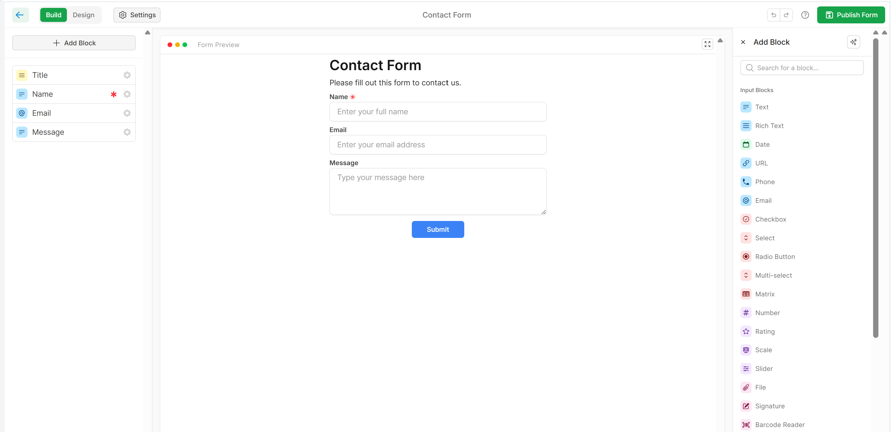
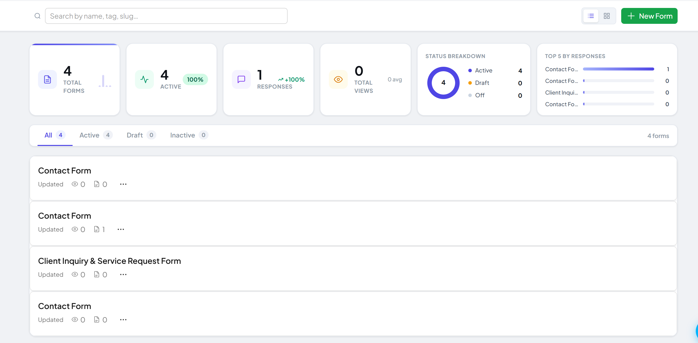
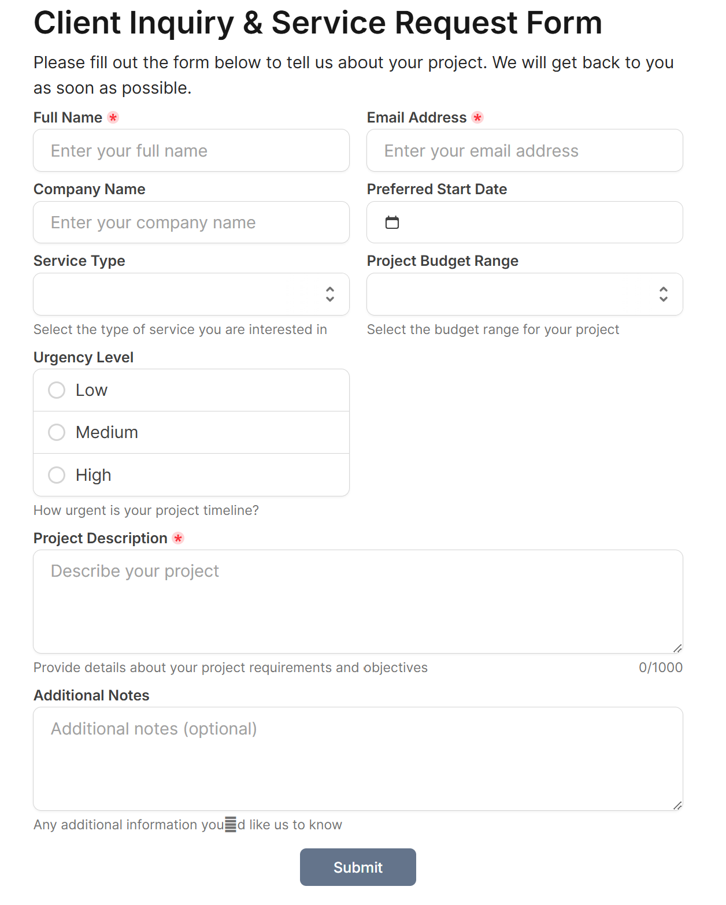
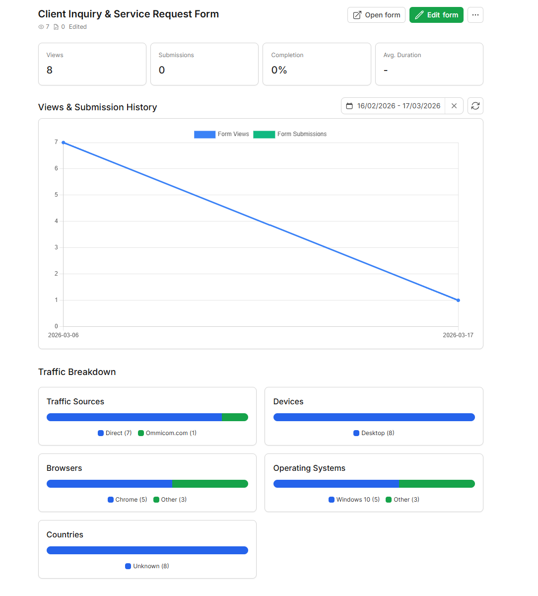

# FormForge

<p align="center">
  <strong>Modern Open-Source Form Builder Platform</strong>
</p>

<p align="center">
  <a href="#">🌐 Demo</a>
  ·
  <a href="#">📦 GitHub</a>
  ·
  <a href="#installation-guide">🚀 Installation</a>
</p>

<p align="center">
  
</p>

<p align="center">
<a href="#"></a>
<a href="#"></a>
<a href="#"></a>
<a href="#"></a>
<a href="#"></a>
<a href="#"></a>
</p>

---

# FormForge Form Builder Platform

FormForge is a modern open-source form builder platform designed for developers, startups, and teams.

The platform provides a flexible drag-and-drop form building experience that helps users create dynamic forms, collect data, manage submissions, and integrate workflows efficiently.

FormForge focuses on clean UI design, modular architecture, scalability, and developer experience.

---

# Project Structure

```bash
FormForge
├── app                 # Laravel backend application
├── client              # React + TypeScript frontend
├── database            # Migrations & seeders
├── docs                # Documentation & previews
├── public              # Static assets
├── resources           # Backend views & assets
├── routes              # API & web routes
└── storage             # Application storage
```

---

# Core Features

## Drag & Drop Form Builder

* Visual form builder
* Real-time form editing
* Component-based architecture
* Flexible form layouts

## Dynamic Form Components

* Text input
* Email field
* Number field
* Select / dropdown
* Checkbox & radio
* Date picker
* File upload
* Rich text editor

## Submission Management

* Store form submissions
* View submission history
* Export submissions
* Data filtering & searching

## Workflow & Integrations

* API integration support
* Email notifications
* JSON form export
* Webhook ready architecture

## Responsive Design

* Mobile friendly
* Tablet optimized
* Desktop support

---

# Demo Preview

## Form Builder

<p align="center">
  
</p>

## Dashboard

<p align="center">
  
</p>

## Form Preview

<p align="center">
  
</p>

## Responsive UI

<p align="center">
  
</p>

---

# Technology Stack

## Backend

| Technology | Version | Description      |
| ---------- | ------- | ---------------- |
| Laravel    | 11.x    | PHP Framework    |
| PHP        | 8.2+    | Backend Language |
| MySQL      | 8+      | Database         |

## Frontend

| Technology   | Description          | Version |
| ------------ | -------------------- | ------- |
| React        | Frontend Library     | 18.x    |
| TypeScript   | Typed JavaScript     | 5.x     |
| Tailwind CSS | UI Framework         | 3.x     |
| Vite         | Build Tool           | Latest  |

---

# Installation Guide

## Requirements

Recommended environment:

* PHP >= 8.2
* Composer >= 2.x
* Node.js >= 18
* NPM >= 9
* MySQL >= 8.x

---

# Installation

## 1. Clone Repository

```bash
git clone https://github.com/your-username/formforge.git
cd formforge
```

---

## 2. Install Backend Dependencies

```bash
composer install
```

---

## 3. Configure Environment

```bash
cp .env.example .env
php artisan key:generate
```

Update database configuration:

```env
DB_DATABASE=formforge
DB_USERNAME=root
DB_PASSWORD=
```

---

## 4. Run Database Migration

```bash
php artisan migrate
```

---

## 5. Install Frontend Dependencies

```bash
cd client
npm install
```

---

## 6. Start Development Server

Backend:

```bash
php artisan serve
```

Frontend:

```bash
cd client
npm run dev
```

Visit:

```text
http://127.0.0.1:8000
```

---

# Architecture

FormForge follows a modern modular architecture:

* Component-driven frontend
* API-first backend
* Reusable form elements
* Modular business logic
* Scalable structure

Main architecture layers:

* Controllers
* Services
* Models
* React Components
* API Routes
* Database Layer

---

# Use Cases

FormForge is suitable for:

* Contact forms
* Registration systems
* Surveys & questionnaires
* CRM data collection
* Internal tools
* Workflow automation
* SaaS products

---

# Roadmap

Upcoming planned features:

* Form analytics
* Real-time collaboration
* AI form generation
* Advanced workflow automation
* Form templates marketplace
* Third-party integrations
* Team management

---

# Contributing

Contributions are welcome.

1. Fork the repository
2. Create your feature branch
3. Commit your changes
4. Push to your branch
5. Open a Pull Request

---

# Security

Please refer to the `SECURITY.md` file for reporting vulnerabilities.

---

# License

MIT License

---

# Author

* Bùi Mạnh Hưng

---

# Support

If you like this project, please give it a ⭐ on GitHub!

---

<div align="center">
  Built with ❤️ using Laravel, React & TypeScript
</div>
