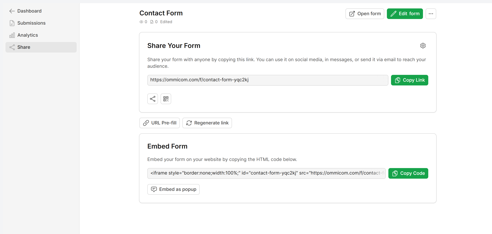

<div align="center">
  <h1>FormForge</h1>
  <p align="center">
    <a href="#">Demo / Playground</a>&emsp;&middot;&emsp;
    <a href="#">FormForge App</a>&emsp;&middot;&emsp;
    <a href="#">GitHub</a>
  </p>
</div>

---

## Introduction

FormForge is a modern and open-source form builder platform for developers and teams. Build forms faster than ever with a powerful drag-and-drop interface and flexible data handling.

Create everything from simple contact forms to complex data collection workflows with ease.

[Try the demo](#) or explore how to get started below.


<br>

## Build simple forms to complex workflows

Use a no-code builder that is flexible enough to create a wide variety of forms — from basic contact forms to advanced business workflows.


Example use cases:

* Contact forms
* Registration forms
* Surveys & questionnaires
* CRM data collection
* Internal tools & workflows

<br>

## Why FormForge?

It's time to move beyond static and outdated form solutions.

FormForge provides a modern approach inspired by drag-and-drop builders and modular design systems, allowing both developers and non-technical users to create forms بسهولة.

Since the platform is open-source, you can fully customize, extend, and self-host it.

<br>

## Built-in Components

Each form element is modular and reusable. Available components include:

* Text Input
* Email Field
* Number Field
* Select / Dropdown
* Checkbox / Radio
* Date Picker
* File Upload
* Rich Text Editor

<br>

## Platform Support

FormForge works seamlessly across:

* Desktop
* Mobile
* Tablet


---

## Form Output

FormForge allows you to:

* Export form structure as JSON
* Store submissions in database
* Send email notifications
* Integrate with external APIs



<br>

## Getting Started

Install and run FormForge locally:

```bash
git clone https://github.com/your-username/formforge.git
cd formforge
```

### Backend

```bash
composer install
cp .env.example .env
php artisan key:generate
php artisan migrate
```

### Frontend

```bash
cd client
npm install
npm run dev
```

---

## Running the Application

```bash
php artisan serve
```

Frontend:

```bash
cd client
npm run dev
```

---

## Contribute

Feel free to report bugs or request features.

If you'd like to contribute:

1. Fork the repository
2. Create a new branch
3. Make your changes
4. Submit a pull request

---

## Security

Please refer to the `SECURITY.md` file for reporting vulnerabilities.

---

## License

This project is licensed under the MIT License.

---

## Author

* Bùi Mạnh Hưng

---

## Support

If you like this project, please give it a ⭐ on GitHub!
